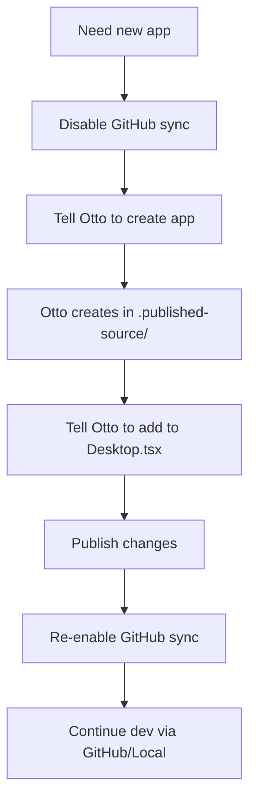
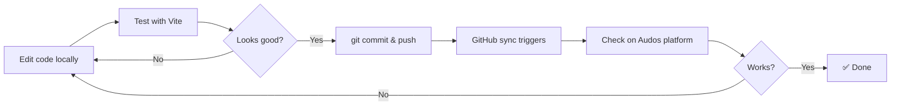

# Audos Development Workflow

This document describes the complete workflow for developing Audos apps, combining local development with the platform.

## Quick Reference: What To Use When

| Task | Use Otto (Platform) | Use GitHub | Use Local Dev |
|------|---------------------|------------|---------------|
| **Create new app** | ✅ **REQUIRED** | ❌ Cannot | ❌ Cannot |
| **Delete app** | ✅ **REQUIRED** | ❌ Cannot | ❌ Cannot |
| Edit app code | ✅ Optional | ✅ Preferred | ✅ Preferred |
| Edit Desktop.tsx | ✅ Optional | ✅ Works | ✅ Works |
| Edit config.json | ✅ Optional | ✅ Works | ✅ Works |
| Create database tables | ✅ Preferred | ❌ Cannot | ❌ Cannot |
| Test UI components | ❌ Slow | ❌ Slow | ✅ **Fast** |
| Test with real data | ✅ **Required** | ✅ Works | ⚠️ With API mode |

## Workflow 1: Creating a New App



### Step-by-Step

1. **Go to Developer tab** in your Audos workspace
2. **Disable GitHub sync**
3. **Tell Otto:**
   > Create a new app called "MyApp" that does X, Y, Z
4. **Tell Otto:**
   > Add MyApp to the Desktop navigation
5. **Say:** "publish it"
6. **Re-enable GitHub sync**
7. **Pull latest changes** to your local repo:
   ```bash
   git pull origin main
   ```

## Workflow 2: Local Development Cycle



### Local Development Setup

```bash
# Clone your repo
git clone https://github.com/youruser/throughline.git
cd throughline

# Install dependencies
npm install

# Run local dev server (pure local mode)
npm run dev

# OR run with real Audos APIs
VITE_USE_REMOTE_API=true npm run dev
```

### Deploying Changes

```bash
# Stage and commit
git add .
git commit -m "Update: add new feature to Briefing app"

# Push to GitHub
git push

# Sync happens automatically via webhook
# Or manually trigger in the Developer tab
```

## Workflow 3: Database Changes

Database tables must be created through Otto or the Audos platform UI.

### Creating a New Table

Tell Otto:
> Create a database table called "episodes" with columns:
> - title (text, required)
> - description (text)
> - guest_name (text)
> - recording_date (date)
> - status (text, default 'draft')

### Querying Tables Locally

Once the table exists, you can query it from local code:

```typescript
import { audos } from './lib/audos-api';

// Query episodes
const { data } = await audos.query('episodes', {
  filters: [{ column: 'status', operator: 'eq', value: 'published' }],
  orderBy: { column: 'recording_date', direction: 'desc' }
});
```

## Workflow 4: Using ShadCN Components

ShadCN components are just React + Tailwind. You can copy them directly:

### Setup

1. Install dependencies:
   ```bash
   npm install class-variance-authority clsx tailwind-merge lucide-react
   ```

2. Create utility file:
   ```typescript
   // src/lib/utils.ts
   import { type ClassValue, clsx } from 'clsx';
   import { twMerge } from 'tailwind-merge';

   export function cn(...inputs: ClassValue[]) {
     return twMerge(clsx(inputs));
   }
   ```

3. Copy components from [ui.shadcn.com](https://ui.shadcn.com) to `src/components/ui/`

### Example: Button Component

```tsx
// src/components/ui/button.tsx

import * as React from 'react';
import { cva, type VariantProps } from 'class-variance-authority';
import { cn } from '../../lib/utils';

const buttonVariants = cva(
  'inline-flex items-center justify-center rounded-md text-sm font-medium transition-colors focus-visible:outline-none disabled:opacity-50 disabled:pointer-events-none',
  {
    variants: {
      variant: {
        default: 'bg-primary text-primary-foreground hover:bg-primary/90',
        outline: 'border border-input bg-background hover:bg-accent',
        ghost: 'hover:bg-accent hover:text-accent-foreground',
      },
      size: {
        default: 'h-10 px-4 py-2',
        sm: 'h-9 rounded-md px-3',
        lg: 'h-11 rounded-md px-8',
      },
    },
    defaultVariants: {
      variant: 'default',
      size: 'default',
    },
  }
);

export interface ButtonProps
  extends React.ButtonHTMLAttributes<HTMLButtonElement>,
    VariantProps<typeof buttonVariants> {}

const Button = React.forwardRef<HTMLButtonElement, ButtonProps>(
  ({ className, variant, size, ...props }, ref) => {
    return (
      <button
        className={cn(buttonVariants({ variant, size, className }))}
        ref={ref}
        {...props}
      />
    );
  }
);

export { Button, buttonVariants };
```

## Workflow 5: Testing With Real Data

When you're ready to test with real Audos data:

```bash
# Start with remote API mode
VITE_USE_REMOTE_API=true npm run dev
```

This will:
- Call the real Audos database APIs
- Use real workspace data
- Still run in your local Vite server

## Workflow 6: The Complete Hybrid Approach

For optimal development speed:

```
1. [LOCAL] Write component code with your IDE
2. [LOCAL] Test UI with mock data (fast iteration)
3. [LOCAL] Test with real API if needed
4. [GITHUB] Commit and push
5. [PLATFORM] Verify on Audos
6. Repeat
```

## Troubleshooting

### "Code editing is frozen"

You're trying to use Otto while GitHub sync is enabled.

**Fix:** Disable GitHub sync in the Developer tab, make your changes, then re-enable.

### New app doesn't appear

The app needs to be:
1. Compiled to `.published-source/` (can only be done by Otto)
2. Added to `Desktop.tsx` (can be done by Otto or GitHub)

**Fix:** Disable GitHub sync, ask Otto to create the app, then re-enable.

### Local changes not syncing

Check that:
1. GitHub sync is enabled
2. You pushed to the correct branch
3. The webhook is configured

**Fix:** Manually trigger sync in the Developer tab.

### Visual differences between local and platform

This is expected. The Audos platform applies:
- Brand theming (colors, fonts)
- Platform chrome (header, dock)
- Global styles

**Accept this** — focus on functionality locally, visual polish happens on the platform.